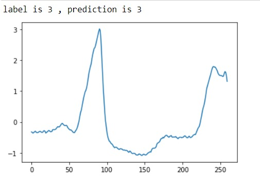
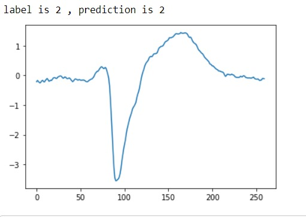
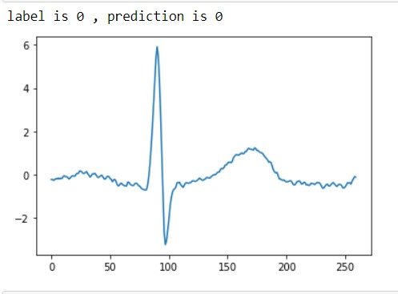
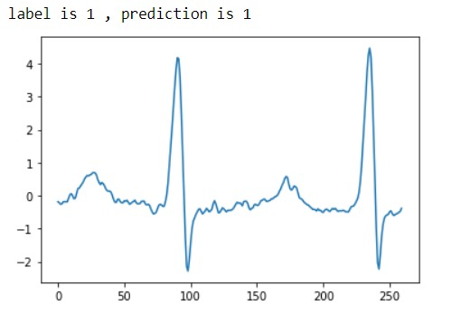

# Classifying-Heartbeats-using-DCNN
The electrocardiogram (ECG) is a routine test for monitoring heart activity. The ECG will show many cardiac abnormalities, including arrhythmia, which is a general term for an irregular heart beat. The identification of normal vs aberrant individual cardiac beats, as well as their proper classification into distinct diagnoses based on ECG morphology, is the foundation of arrhythmia diagnosis. Non-ectopic, supraventricular ectopic, ventricular ectopic, fusion, and unknown beats are the five kinds of heartbeats. The ECG signal is frequently distorted by noise, making it difficult and time-consuming to differentiate these heartbeats. In this Project, I have made 9-layer deep convolutional neural network (CNN) to automatically identify 5 different categories of heartbeats in ECG signals.
## Output of our Model on the mentioned datasets
 &ensp;  
 &ensp;  
 &ensp; 
 &ensp;
